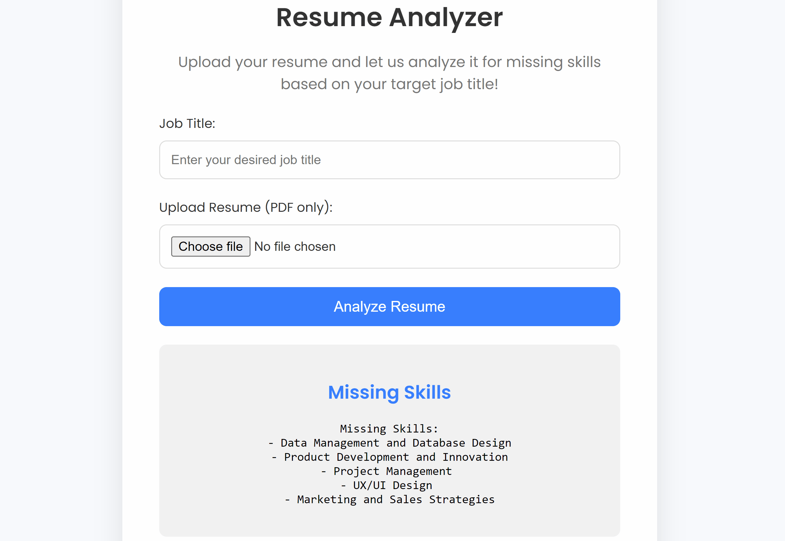
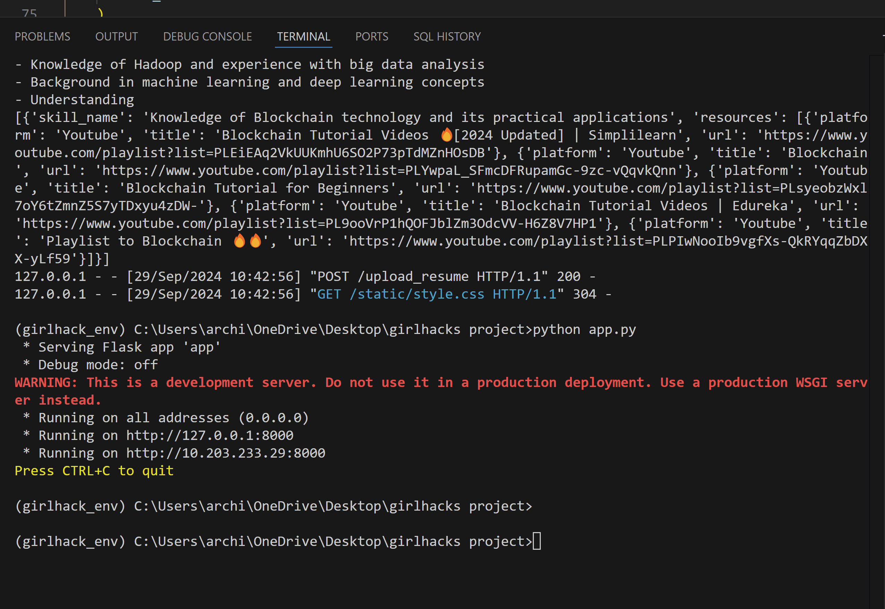

# Skill Recommender With Azure Open AI

This is a simple yet intutive and a powerful application which takes resume and dream job title, extracts skills from resume and compare them with trending skills from the
current market and recommends the skills needed to achieve that dream job title

# Tech Overview

This application uses Flask Backend which is further using Azure OpenAI API and YouTube Data API to generate recommendations, HTML/CSS as frontend to showcase the magic!




## Getting Started

These instructions will get you a copy of the project up and running on your local machine for development and testing purposes.

### Prerequisites

What things you need to install the software and how to install them

Download Flutter sdk from flutter.dev.
Copy the sdk to C:\src\flutter
Launch flutter_console

```

```

This command would give you a clear interpretation of remaining tasks to be completed for flutter to operate successfully.

### Installing
If you are new to python, use Ananconda to install Python effortlessly.

Now, Download VS Code and install it.
(You can also use Android Studio if you prefer that)

After installing, procure OPEN AI API and YOUTUBE API from Azure and GCP respectively.

Now, Connect the respective device to your laptop i.e.
* iOS Device for Mac
* Android Device for Windows

Now, We can Start project by simple Command
```
python app.py
```

And to run this Flask Project smoothly.


## Built With

* [Python](https://www.python.org/downloads/) - The Cross Platform framework used for App & Web Development
* [Tensorflow lite](https://www.tensorflow.org/lite) - TensorFlow Lite is an open source deep learning framework for on-device inference.
* [SplashScreen](https://pub.dev/packages/splashscreen) - It is a Flutter package that effortlessly create splashcreen to make application intuitive.

## Authors

* **Arpit Shrotriya** - *Initial work* - [Cyclostone](https://github.com/Cyclostone)

## Acknowledgments

* Hat tip to anyone whose code was used
* Integrating Tensorflow and Flutter
* Inspiration

